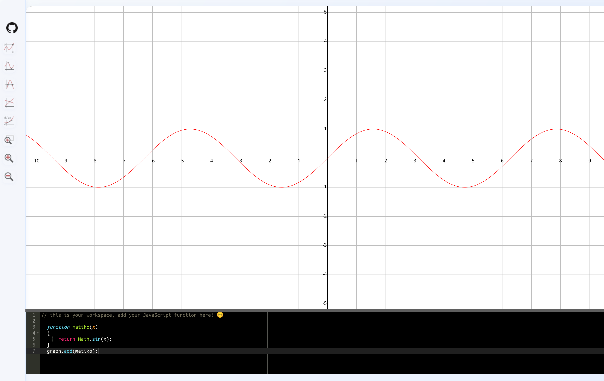

# Javascript Visualizer

**A web application that allows users to view their math-like JavaScript code snippets.**  


---

## 🌟 Features  

- **Interactive layout**: Easily edit data in the common tabled format.  
- **Dynamic Chart Rendering**: Generate beautiful, interactive chart from your data in real-time.  
- **Responsive Design**: Works seamlessly across devices and screen sizes.  
---

## 🖥️ Project Structure  

This project is organized as follows:  

1. **HTML**: Core layout of the app (`index.html`).  
2. **CSS**: Styling for a sleek, responsive interface (`style.css`).  
3. **JavaScript**: Handles CSV parsing, chart rendering, and interactivity cooperating with JQuery.  

---

## 🚀 How to Use  

1. **Clone the Repository**:  
   ```bash  
   git clone https://github.com/emma7iko/javascript-visualizer.git  
   ```  

2. **Navigate to the Project Directory**:  
   ```bash  
   cd javascript-visualizer 
   ```  

3. **Open the App in Your Browser**:  
   Simply open `index.html` in your browser to start using the app.  

---

## 🛠️ Built With  

| **Technology**      | **Logo**                                  |  
|----------------------|-------------------------------------------|  
| HTML5               |  |  
| CSS3                |  |  
| JavaScript          |  | 
| jQuery              |  |

---
